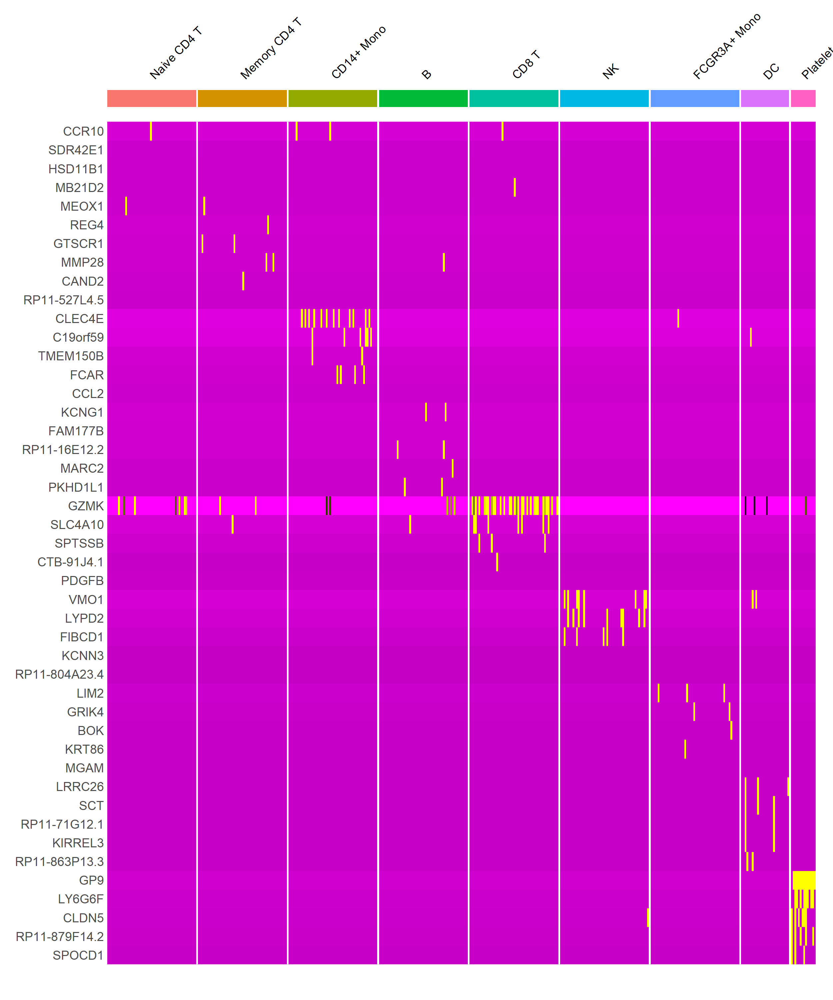

# PBMC 3k scRNA-seq Analysis

تحليل بيانات Single Cell لعينة PBMC باستخدام Seurat.

**Author:** soliman attia

## النتايج
1. تحديد 9 أنواع خلايا مناعية
2. رسم UMAP و Heatmap للـ clusters  
3. مقارنة بين CD14+ Mono و FCGR3A+ Mono

## الملفات
- `script scRNA.R` : الكود الكامل للتحليل
- `heatmap_top5.png` : أهم الجينات لكل نوع خلية
- `DEG_results.csv` : نتائج المقارنة بين المونوسايت
- `README.md` : الشرح ده

### Heatmap لأهم 5 جينات

